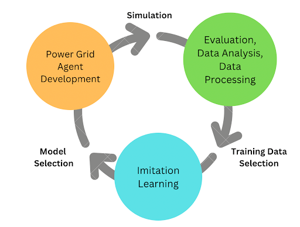

Code accompanying the study by de Jong et al. "[Generalizable Graph Neural Networks for Robust Power Grid Topology Control](https://arxiv.org/abs/2501.07186)". The setting with unplanned outages is implemented in the 'unplanned_outages' branch. Please reach out to me through matthijsdj@live.nl .

This repository is provided for transparancy, reproducability, and re-use in future projects. However, this project will not be further maintained. Additionally, certain parts of the projects might require additional work. In particular:
- This project uses the `rte_case14_realistic` environment, which has since been deprecated. Future research should use `l2rpn_case14_sandbox`.
- Saving state-experts pairs currently involves saving the Grid2Op environment with `to_vect()` function of the `Observation` class. However, this representation is not forward compatible: the vector representation might change between Grid2Op versions, making loading vectors from previous versions impossible.
- The intra-day setup, where scenarios are split into seperate days, does not work harmoniously with Grid2Op. Extensions to the environent, e.g. the inclusion of a Grid2Op opponent, clash with the functionality for splitting days. I would recommend against the usage of this implementation in future projects, in favor of a better integrated implementation.

The project can be mostly divided in three stages:

  

The first stage concerns applying the agents to the environment. The second concerns analysing and processing of the state-action pair data. The third concerns imitation learning (IL) on the processed data. The developped IL models can then be applied again on the environment in the first stage. The following sections describe each stage and the relevant files and config options. 

## 0. Auxiliary modules

Some functionality is used in multiple stages of the project. This concerns four files:

- [`auxiliary/config.py`](auxiliary/config.py) is the module that is responsible for loading, validating, potentially overwriting, and accessing the configuration dictionary. The configuration file is `config.yaml`. It permits the overwriting of values in the configuration dictionary, but only **before** the configuration dictionary is accessed. The top-level scripts feature the option to overwrite values through command line arguments.
- [`auxiliary/generate_action_space.py`](auxiliary/generate_action_space.py) is the module responsible for creating the space of valid, unique set-actions. This module was adapted from Subramanian et al. I take no credit and responsibility for the implementation.
- [`auxiliary/grid2op_util.py`](grid2op_util.py) contains miscellaneous functionality relating to Grid2Op.
- [`auxiliary/util.py`](util.py) contains miscellaneous functionality not relating to Grid2Op.

## 1. Simulation

Most simulation functionality happens within the `simulate` function in `simulation\simulation.py`. This function initializes the Grid2Op environment and agent, and consequently loops over the days and scenarios. The agent is implemented by the `Agent` class, which utilizes a `AgentStrategy` subclass to select actions. `AgentStrategy` is an abstract base class (ABC), and its children implement different strategies, be it rule-based, ML-based, or hybrid. The simulation produces a log file and potentially a dataset of state-action pairs. The 'state' is represented by a vector representation of a Grid2Op `Observation` object.

The code for simulation is contained in four files:
- [`simulation/simulation.py`](simulation/simulation.py) contains the simulation functionality.
- [`simulation/strategy.py`](simulation/strategy.py) contains the functionality for the different strategies.
- [`simulate.py`](simulate.py) is a top-level script that initiates the simulation.
- [`parse_logs.py`](parse_logs.py) is a top-level script that summarizes the information in log files.

Configuration options that might need additional explanation are:
- `paths.rte_case14_realistic`: the directory where the environment is installed.
- `paths.evaluation_log`: the path for the created simulation log file.
- `paths.data_split`: the directory containing `{train/val/test}_scenarios.npy`, representing Numpy arrays containing the corresponding scenario indices.
- `paths.data.raw`: the directory where the generated data will be stored.
- `simulation.`: the various configuration settings (or constants), most of which should be self-evident.
- `simulation.disable_line`: which line to statically disabled. Value '-1' represents no line.
- `simulation.activity_threshold`: the activity threshold, below which (explicit) do-nothing actions are selected. Such actions are not printed of logged.
- `simulation.strategy`: which strategy to use. The enum values are stored in `auxiliary/config.py`.
- `rte_case14_realistic.`: the constants for the environment. Stored so that this information is available without the need to load the environment. With one exception:
- `rte_case14_realistic.thermal_limits`: Values which overwrite the standard thermal limits of the environment.

## 2. Data analysis and preprocessing

Data analysis is performed in a Jupyter notebook. Data procesessing produces three outputs: 
- the processed datafiles, seperated in train/val/test folders;
- a file with feature statistics for normalization, which is used during training, evaluation, and inference;
- a file containing a hash table for adjacency matrices. Datatpoints store the network topology through a hash in this table.
Data preprocessing works by loading in the Grid2Op `Observation`s represented in the raw data, and extracting and processing the important information. For graph neural networks (GNNs), the endpoints objects of disabled lines are removed. Removal of these objects requires the altering of various (environmental) variables for consistency. These variables are stored as '**reduced**' variables. Datapoints are shuffled by loading datapoints into a large buffer, and when this buffer exceeds some threshold, sampling (without replacement) from this buffer, and conseqeuently storing the samples datapoints in files.

The code for analysis and preprocessing is contained in three files:
- [`data_preprocessing_analysis/data_analysis.ipynb`](data_preprocessing_analysis/data_analysis.ipynb) is the notebook that contains the data analysis functionality.
- [`data_preprocessing_analysis/data_preprocessing.py`](data_preprocessing_analysis/data_preprocessing.py) contains the functionality for the data preprocessing.
- [`preprocess_data.py`](preprocess_data.py) is a top-level script that initiates the data processing.

Configuration options that might need additional explanation are:
- `paths.rte_case14_realistic`: the directory where the environment is installed.
- `paths.data_split`: the directory containing `{train/val/test}_scenarios.npy`, representing Numpy arrays containing the corresponding scenario indices.
- `paths.data.raw`: the directory where the raw data is stored.
- `paths.data.processed`: the directory where the processed data, and the two auxiliary files, are stored.
- `data_processing.buffer_size`: the size of the buffer used for shuffling datapoints.
- `data_processing.output_file_size`: the maximum number of datapoints per output file.
  
## 3. Imitation learning

The training happens within the `start()` function of the `Run` object. In the initialisation of the `Run` object, the important classes are initialised:
- A `Model` object, which is an abtsract base class (ABC) with two inheriting classes: `FCNN` and `GCN`. `Model` itself inherits from `torch.nn.Module`. The `layer_type` attribute of the `GCN` class can be either `NetworkType.HOMO` or `NetworkType.HETERO`, and depending on this variable, homogeneous or heterogeneous layers are created.
- Two `Dataloader` objects: one for the training, and one for the validation set. Depending on the model, datapoints need different processing. The Dataloader implements this by using a `ProcessDataPointStrategy` abstract base class, which is inherited by the `ProcessDataPointFCNN` and `ProcessDataPointGCN` subclasses.
- Two `IncrementalAverageMetrics` objects, which are used for tracking metrics that can be expressed as incremental averages during training and evaluation.
- An `ActSpaceCache` object, which is used to match model predictions to valid actions.
Logging to Weights and Biases (W&B) is implemented in the training cycle.

The code for analysis and preprocessing is contained in seven files:
- [`training/dataloader.py`](training/dataloader.py) contains the data loading functionality.
- [`training/evaluation.py`](training/evaluation.py) contains functionality for tracking various metrics, such as the `IncrementalAverageMetrics` class.
- [`training/models.py`](training/models.py) contains the ML model definitions.
- [`training/postprocessing.py`](training/postprocessing.py) contains the postprocessing functionality, i.e. the `ActSpaceCache` object that matches model predictions to valid actions.
- [`training/training.py`](training/training.py) contains the core training functionality, including the trianing loop. It also contains the `evaluate_dataset()` functions, which can be used to evaluate a model on a dataset (during or outside of training).
- [`train_network.py`](train_network.py) is a top-level script that initiates the training.
- [`evaluation.ipynb`](evaluaion.ipynb) is notebook for evaluating and analysing a trained model.

Configuration options that might need additional explanation are:
- `paths.data.processed`: the directory where the processed data, and the two auxiliary files, are stored.
- `paths.wandb`: the directory where W&B data will be logged.
- `paths.model`: the filepath that the model will be written to.
- `training.settings.advanced_val_analysis`: whether to perform, and potentially log to W&B, a more advanced analysis with multiple plots on the validation dataset.
- `training.settings.line_outages_considered`: lines to include in a plot with accuracy per line outage.
- `training.hyperparames.model_type`: wether to use a FCNN or GCN (i.e. GNN). Possible values are stored in `auxiliary/config.py`.
- `training.hyperparames.label_weights.type`: which labels not to give a decreased label weight (see the paper). Possible values are stored in `auxiliary/config.py`.
- `training.GCN.hyperparams.network_type`: wether to use a homogeneous or heterogeneous GNN (see the paper). Possible values are stored in `auxiliary/config.py`.
- `training.GCN.hyperparams.aggr`: wether to use the mean or addition as the aggregation function. Possible values are stored in `auxiliary/config.py`.

You might see functionality for varying GNN layers. The default is SageConv, which is described in the paper. The alternative in GINConv, which is theoretically more expressive. This is implemented but not tested.

